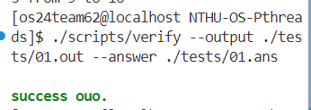

## Functions Implementation
### main function
I finished classes (`Reader`, `Producer`, `ConsumerController`, and `Writer`) that derives from class `thread`

Dynamically allocate three thread safe queue from `TSQueue` class 
```
	TSQueue<Item*>* input_queue = new TSQueue<Item*>(READER_QUEUE_SIZE);
	TSQueue<Item*>* worker_queue = new TSQueue<Item*>(WORKER_QUEUE_SIZE);
	TSQueue<Item*>* output_queue = new TSQueue<Item*>(WRITER_QUEUE_SIZE);
```
#### Initialize program based on the spec
Create a reader thread that reads from input file, every time it reads `expected lines` from the file
```
Reader* reader = new Reader(expected_lines, input_file_name, input_queue);
reader->start();
```
Dynamically allocate a transform thread that does transformation based on `Item`'s `opcode` and `val`
```
Transformer* transformer = new Transformer();
```
Dynamic allocate and start 4 producer threads, which will do the transforming and add the result to `worker queue`
```
std::vector<Producer*> producers;

	for (int i = 0; i < 4; i++) {
		Producer* producer = new Producer(input_queue, worker_queue, transformer);
		producer->start();
		producers.push_back(producer);
	}
```
Dynamically allocate a `Consumer_controller` thread which controls how many `consumer threads` there will be based on `CONSUMER_CONTROLLER_LOW_THRESHOLD_PERCENTAGE` and `CONSUMER_CONTROLLER_HIGH_THRESHOLD_PERCENTAGE`
```
	ConsumerController* consumer_controller = new ConsumerController(
		worker_queue,
		output_queue,
		transformer,
		CONSUMER_CONTROLLER_CHECK_PERIOD,
		WORKER_QUEUE_SIZE * CONSUMER_CONTROLLER_LOW_THRESHOLD_PERCENTAGE / 100,
		WORKER_QUEUE_SIZE * CONSUMER_CONTROLLER_HIGH_THRESHOLD_PERCENTAGE / 100
	);
	consumer_controller->start();
```
**Synchronize** thread by waiting here until it finishes its job
```
	reader->join(); // wait for reader thread to complete
	// cout << "reader thread complete" << endl;
	writer->join(); // wait for writer thread to complete
```
Releases dynamically allocated content to avoid memory leak
```
	// delete threads
	delete reader;
	delete writer;
	delete consumer_controller;
	delete transformer;	
	for (auto& producer : producers) {
		delete producer;
	}
	// delete queues
	delete input_queue;
	delete worker_queue;
	delete output_queue;
```
Now, I'll explain the data structure `TSQueue` and each thread class implementaion.

**解釋一下會用到的pthread函式:**

`pthread_mutex_lock(&mutex);`
這個蠻obvious就是獲得mutex lock，讓一次只能一個thread進到critical section

`pthread_cond_wait(&cond_enqueue, &mutex);`
這個會atomically release mutex, 才不會這邊在等，別的thread也進不來critical condition

`pthread_cond_signal(&cond_dequeue); `
這個signal conditional variable, 跟在等待(waiting)的thread

`pthread_create(&t, NULL, process, this);`
&t: pointer to pthread_t 物件，ID會被存在 pthread_t 裡面，然後 create 之後會去做 process函式，this 是會被傳到函式的參數

`pthread_setcanceltype(type, nullptr):`
type:
* PTHREAD_CANCEL_DEFERRED: 確保thread只會回應一些特定的cancellation request (像是 pthread_cond_wait, pthread_testcancel)
* PTHREAD_CANCEL_ENABLE: 讓 thread 可以回應 cancellation request
* PTHREAD_CANCEL_DISABLE: 避免 thread 回應 cancellation request

`pthread_join(t, 0);`
Synchronize thread 等這個thread t完成工作，等在這邊直到完成

`pthread_cancel(t);`
Used to terminate a thread: request cancellation of the specified thread
*  Return 0: success

### TS_QUEUE.hpp
TS_QUEUE 是thread safe queue的簡稱，其實就是一個用pthread mutex實作的queue，支援enqueue(), dequeue(), size()這一些基本的member function. 資料結構選擇用array來做circular queue。

`TSQueue<T>::TSQueue(int buffer_size) : buffer_size(buffer_size)`
* We initialized the head, tail, size for the queue. Also, we initialize mutex lock and 2 conditional variables called `cond_enqueue` and `cond_dequeue`. 
* By the way, the conditional variables is to prevent busy waiting of CPU.
```
template <class T>
TSQueue<T>::TSQueue(int buffer_size) : buffer_size(buffer_size) {
	// TD: implements TSQueue constructor
	buffer = new T[buffer_size];
	size = 0;
	head = buffer_size - 1;
	tail = 0;
	// initialize pthread mutex lock
	pthread_mutex_init(&mutex, NULL);
	// initialize pthread conditional variable
	pthread_cond_init(&cond_enqueue, NULL);
	pthread_cond_init(&cond_dequeue, NULL);	
}
```
`TSQueue<T>::~TSQueue() `
* Destructor: release memory for conditional variables and mutex lock.
```
template <class T>
TSQueue<T>::~TSQueue() {
	// TD: implenents TSQueue destructor
	delete [] buffer;
	pthread_cond_destroy(&cond_dequeue);
	pthread_cond_destroy(&cond_enqueue);
	pthread_mutex_destroy(&mutex);
}
```
`void TSQueue<T>::enqueue(T item)`
* The enqueue function: adds a `Item*` at the `tail` of our circular queue
* To prevent race condition, we use `pthread_mutex_lock` and `pthread_mutex_unlock` to implement a critical section.
* To prevent CPU being blocked inside the while loop, use `pthread_cond_wait` to set the thread to sleeping state and release mutex lock.
```
template <class T>
void TSQueue<T>::enqueue(T item) {
	// TD: enqueues an element to the end of the queue
	pthread_mutex_lock(&mutex);
	// queue is full => blocked 
	while (size == buffer_size) {
		pthread_cond_wait(&cond_enqueue, &mutex);
	}
	// has space to enqueue, enqueue from tail
	buffer[tail] = item;
	tail = (tail + 1) % buffer_size;
	size++;
	pthread_cond_signal(&cond_dequeue);	
	pthread_mutex_unlock(&mutex);
}
```
`T TSQueue<T>::dequeue()`
* The dequeue function: pops a `Item*` at the `head`+1 of our circular queue
* To prevent race condition, we use `pthread_mutex_lock` and `pthread_mutex_unlock` to implement a critical section.
* To prevent CPU being blocked inside the while loop, use `pthread_cond_wait` to set the thread to sleeping state and release mutex lock.
```
template <class T>
T TSQueue<T>::dequeue() {
	pthread_mutex_lock(&mutex);
	// queue is full => blocked 
	while (size == 0) {
		pthread_cond_wait(&cond_dequeue, &mutex);
	}
	// has item at head, dequeue from head
	head = (head + 1) % buffer_size;
	T item = buffer[head];
	size--;
	pthread_cond_signal(&cond_enqueue);
	pthread_mutex_unlock(&mutex);
	return item;
}
```
`int TSQueue<T>::get_size()`
* Returns the size of the queue
```
template <class T>
int TSQueue<T>::get_size() {
	// TD: returns the size of the queue
	return size;
}
```
### reader.hpp
goal: Reads from the input file line by line and enqueues to the `input queue`

`void Reader::start()`
* Use pthread_create() to run `Reader::process` using the current thread 
```
void Reader::start() {
	pthread_create(&t, 0, Reader::process, (void*)this);
}
```
`void* Reader::process(void* arg)`
* Keeps reading from the filestream from the inputfile. Until it reads total of `expected_lines` then stop.
```
void* Reader::process(void* arg) {
	Reader* reader = (Reader*)arg;

	while (reader->expected_lines--) {
		Item *item = new Item;
		reader->ifs >> *item;
		// std::cout << *item << std::endl; // for debugging (looks good)
		reader->input_queue->enqueue(item);
	}
	return nullptr;
}
```
### producer.hpp
goal: Infinitely deques the data from `input_queue` using `producer_transform` then write to the produced data to `worker_queue`

* Use pthread_create() to run `Producer::process` using the current thread 
```
void Producer::start() {
	pthread_create(&t, NULL, process, this);
}
```
`Producer::process(void* arg)`
* The producer does the first transform `producer_transform` via `transformer*` thread, then appends to the worker queue.
```
void* Producer::process(void* arg) {
    Producer* producer = static_cast<Producer*>(arg);
    while (true) {
        // Blocking dequeue call
        Item* rawItem = producer->input_queue->dequeue();
    
        // Transform the item
        auto val = producer->transformer->producer_transform(rawItem->opcode, rawItem->val);
        // std::cout << val << std::endl; // for debugging (looks good)
        // Enqueue the transformed item
        producer->worker_queue->enqueue(new Item(rawItem->key, val, rawItem->opcode));
        
        // Clean up the raw item
        delete rawItem;
    }
    return nullptr;
}
```
### consumer.hpp
goal: does transform on the data in `worker queue` and enqueues to the `output queue`
`Consumer::start()`
* The functionality is same as previous
```
void Consumer::start() {
	pthread_create(&t, nullptr, process, this);
}
```
* Thread cancellation details:
**1. Why Cancel a Thread?**
Thread cancellation is essential in multithreaded applications for several reasons:

- **Graceful Shutdown:** When your application needs to terminate (e.g., user intervention, completion of tasks), it's crucial to stop all running threads to ensure a clean exit.
  
- **Resource Management:** Threads consume system resources (CPU, memory). Canceling unnecessary threads helps in freeing these resources, preventing potential memory leaks or resource exhaustion.
  
- **Synchronization and Coordination:** In scenarios where threads are interdependent, canceling one thread might be necessary to maintain the integrity of the overall workflow or to prevent deadlocks.
  
- **Error Handling:** If a thread encounters a critical error or exception from which it cannot recover, canceling it can prevent the application from entering an unstable state.

### **2. What Happens When a Thread Is Canceled?**

When you invoke `pthread_cancel(t)` on a thread `t`, several things occur based on how the thread is configured to handle cancellation:

**a. Cancellation Types**

Pthreads support two primary cancellation types:

1. **Asynchronous Cancellation (`PTHREAD_CANCEL_ASYNCHRONOUS`):**
   - **Behavior:** The thread is terminated immediately when `pthread_cancel` is called.
   - **Pros:** Quick termination.
   - **Cons:** Unsafe as it can interrupt the thread while it's holding locks or in the middle of critical operations, potentially leading to inconsistent program states or deadlocks.

2. **Deferred Cancellation (`PTHREAD_CANCEL_DEFERRED`):**
   - **Behavior:** The thread checks for cancellation requests at specific cancellation points (e.g., `pthread_cond_wait`, `pthread_mutex_lock`, `read`, `write`).
   - **Pros:** Safer as it allows the thread to reach a safe state before termination.
   - **Cons:** The thread might continue running until it reaches the next cancellation point, leading to delayed termination.

   **Default Type:** Most threads default to **deferred cancellation**.

**b. Cancellation State**

Threads can have their cancellation state enabled or disabled:

- **Enabled (`PTHREAD_CANCEL_ENABLE`):** The thread can be canceled.
- **Disabled (`PTHREAD_CANCEL_DISABLE`):** The thread ignores cancellation requests.

   **Default State:** **Enabled**.

**c. Execution Flow Upon Cancellation**

1. **Cancellation Request:** `pthread_cancel(t)` sends a cancellation request to thread `t`.
2. **Handling the Request:**
   - **If Asynchronous:** The thread is terminated immediately.
   - **If Deferred:** The thread proceeds until it reaches the next cancellation point.
3. **Cleanup Handlers:** Before termination, any cleanup handlers registered using `pthread_cleanup_push` are executed to release resources, unlock mutexes, etc.
4. **Thread Termination:** The thread exits, and its resources are reclaimed by the system.
```
int Consumer::cancel() {
	// TD: cancels the consumer thread
	is_cancel = true;
	return pthread_cancel(t);
}
```

`Consumer::process(void* arg)`
* Transform `Item*` using `transformer->consumer_transform(item->opcode, item->val)`
* `pthread_setcanceltype(PTHREAD_CANCEL_DEFERRED, nullptr);`: This line ensures the cancellation is at the next cancellation point. It's considered safer than Asynchronous cancellation 
* `pthread_setcancelstate(PTHREAD_CANCEL_DISABLE, nullptr);`: Temporarily disables cancel, in this way, threads won't terminate in the middle of transformation
```
void* Consumer::process(void* arg) {
	Consumer* consumer = (Consumer*)arg;

	pthread_setcanceltype(PTHREAD_CANCEL_DEFERRED, nullptr);

	while (!consumer->is_cancel) {
		pthread_setcancelstate(PTHREAD_CANCEL_DISABLE, nullptr);

		Item* item = consumer->worker_queue->dequeue();

		unsigned long long val = consumer->transformer->consumer_transform(item->opcode, item->val);
		// std::cout << val << std::endl; // for debugging (looks good)
		consumer->output_queue->enqueue(new Item(item->key, val, item->opcode));
		delete item;

		pthread_setcancelstate(PTHREAD_CANCEL_ENABLE, nullptr);
	}
	return nullptr;
```
### Consumer_controller
goal: increase or decrease the number of consumer threads by 1 based on `worker_queue` size
`ConsumerController::start()`
starts the thread and runs the process
```
void ConsumerController::start() {
	// TODO: starts a ConsumerController thread
	pthread_create(&t, NULL, process, this);
}
```
`void* ConsumerController::process(void* arg)`
* determines scale up or scale down based on `int current_size = controller->worker_queue->get_size();`
* in the infinite while loop, `usleep(controller->check_period);` enables controller to do periodic monitoring on the `worker_queue`
* adds all the thread inside a vector for efficient deletion.
```

void* ConsumerController::process(void* arg) {
    ConsumerController* controller = static_cast<ConsumerController*>(arg);

    while (true) {
        // Sleep for the specified check period
        usleep(controller->check_period);

        // Get the current size of the worker queue
        int current_size = controller->worker_queue->get_size();

        // Scale up: Add a new Consumer if queue size exceeds high_threshold
        if (current_size > controller->high_threshold) {
            Consumer* new_consumer = new Consumer(controller->worker_queue, controller->writer_queue, controller->transformer);
            controller->consumers.push_back(new_consumer);
            new_consumer->start();
            std::cout << "Added a new Consumer. Total Consumers from " << controller->consumers.size()-1 << " to " << controller->consumers.size() << std::endl;
        }
        // Scale down: Remove the last Consumer if queue size is below low_threshold
        else if (current_size < controller->low_threshold && controller->consumers.size() > 1) {
            Consumer* consumer_to_remove = controller->consumers.back();
            consumer_to_remove->cancel();
            controller->consumers.pop_back();
            delete consumer_to_remove;
            std::cout << "Removed a Consumer. Total Consumers from" << controller->consumers.size()+1 << " to " << controller->consumers.size() << std::endl;
        }
    }
    return nullptr;
}
```
### `Writer.hpp`
goal: Writes from output queue to output file.
starts the thread and runs `writer::process(void* arg)`.
```
void Writer::start() {
	// TD: starts a Writer thread
	// create and starts a new pthread and runs process function
	int ret = pthread_create(&t, NULL, process, this);
	if (ret != 0) {
		std::cerr << "pthread_create failed: " << ret << std::endl;
	}
}
```
`void* Writer::process(void* arg)`
Keep writing from `output_queue` to output file using the provides output stream.
* decrease `expected_lines` when write a line. The thread ends when every line has been written.
```
void* Writer::process(void* arg) {
	// TD: implements the Writer's work
	// change the pointer to writer's pointer
	Writer* writer = static_cast<Writer*>(arg);
	if (!writer->output_queue || !writer->ofs.is_open()) {
		std::cerr << "output_queue or output file not open" << std::endl;
		return NULL;
	}
	// decrease expected lines and write to file
	while (writer -> expected_lines > 0) {
		Item* item = writer->output_queue->dequeue();
		// std::cout << *item << std::endl;
		if (writer->ofs.fail()) {
            std::cerr << "Failed to write item to file." << std::endl;
            break;
        }
		writer->ofs << *item;
		--writer->expected_lines;
		// writer->ofs.flush();
	}
	return NULL;
}
```


## Experiments
I tested the program 4 different specs `average latency` `min latency` `max latency` and `total execution time` on **test01**. Latency is calculated from an Item gets input into `input_queue` to output from `output_queue`

After a few tests, I observed there is random sporadically high `max latency` in my tests. For instance, `average latency` remains around 30µs but spikes would reach up to 2000+ µs. Factors such as uneven thread workload, context switch, waiting for the mutex lock would increase latency. Therefore, I'm just going to focus on throughput and average latency.

### Different values of consumer controller check period
Did 3~5 tests and average the results
|  check period (µs)  | average latency (ms)   |  total execution time (ms)   |
|----------|----------|----------|
| 1000000   | 30   | 59774   |
| **100000**   | 33   | 51478   |
| 10000   | 30.33   | 53894.3   |

#### Discussion and conclusion: 
1. the average latency doesn't have significant relationship with total execution time. 100000µs has the shortest execution time but has the highest average latency for each Item.
2. The check period of 100000µs is the optimum point in the experiment. When period is high, it's not responsice. On the other hand, if period is too low, checking also leads to overhead.

From now on I'll choose 100000µs as my **control group**

### Different values of low/high threshold
Did 3~5 tests and average the results
|  low/high (%)  | average latency (ms)   |  total execution time (ms)   |
|----------|----------|----------|
| 20/80 (control)   | 33   | 51478   |
| 20/90   | 33.33   | 53881.67   |
| **20/70**  | 30   | 51245.67   |
| 20/60  | 36.33   | 51644   |
| 10/80  | 32.33   | 53877   |
| 30/80  | 31.33   | 54758   |
| 30/70  | 33.33   | 51302   |

#### Discussion and conclusion:
1. Raising the high threshold increases the execution time as expected due to less responsiveness; and lower high threshold decrease very slightly my guess is because the controller increase consumer faster.
2. However, when I either increase/decrease the low threshold the execution time increases. 
3. In my tests, 20/70 has the best execution time 

### Different worker queue size
Did 3~5 tests and average the results
|  worker queue size  | average latency (ms)   |  total execution time (ms)   |
|----------|----------|----------|
| 200 (control)   | 33   | 51478   |
| 10  | 73   | 51792.33   |
| **100**   | 37   | 51424   |
| 500  | 41.66   | 59112   |
| 2000  | 35   | 130869   |


#### Discussion and conclusion
* When worker queue is small, especially size = 10, the consumer number keeps fluctuating. I assume it *produce overhead of adding and deleting threads*
* When worker queue is large, especially size = 2000. Due to multiple enqueue() dequeue() *waiting for the mutex lock* the execution time becomes very significant

### Very small writer queue size
Did 3~5 tests and average the results
|  writer queue size  | average latency (ms)   |  total execution time (ms)   |
|----------|----------|----------|
| 4000   | 33   | 51478   |
| 400   | 32   | 55313   |
| 40   | 34   | 51631   |

#### Discussion and conclusion
* The *writer queue is not a bottleneck*, it writes item to output file faster than consumer enqueue's speed. Also a smaller writer queue consumes less memory lead to better *cache locality*.

### Very small reader queue size
Did 3~5 tests and average the results
|  reader queue size | average latency (ms)   |  total execution time (ms)   |
|----------|----------|----------|
| 200   | 33   | 51478   |
| 20  | 32.33   | 52753   |

#### Discussion and conclusion
* The *reader queue is not a bottleneck*, it reader item to output file faster than producer dequeue's speed. 

## difficulties
I think this pthread is more easy than NachOS homework because I don't have to go through large code base and know the complicated relationships between the functions. If there is a TA session that teaches us pthread functions and how to monitor thread using other packages would be extra helpful!

## Reflection
This final project is fun and gives me an experience of implementing the classic producer consumer problem. Also, it's also great experience learning how to use pthread module gives me more sense of multithread programming! Furthermore, the experiment part is also beneficial, allowing me to do more 

